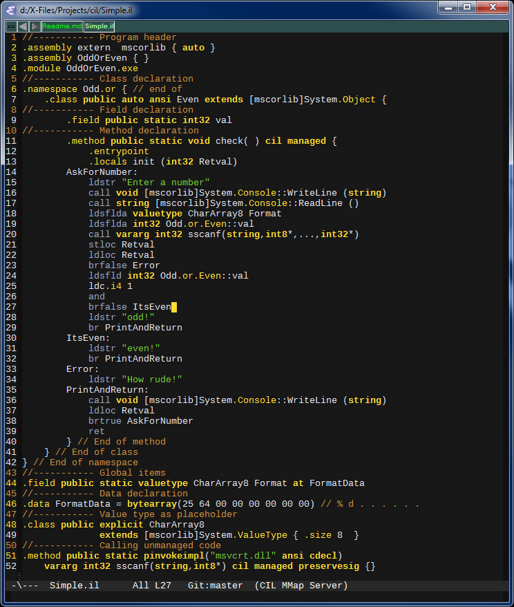

cil-mode  
========
cil-mode is a major [emacs](http://www.gnu.org/software/emacs/) mode for editing of [Common Intermediate
Language](http://en.wikipedia.org/wiki/Common_Intermediate_Language). It helps emacs to highlight CIL keywords and sets
up the proper indentation for such files.

Common Intermediate Language is also known as ILAsm, MSIL or simply IL. It is a low-level assembly-like programming
language targeting CLI environment (most successful implementations of that specification are
[.NET](http://www.microsoft.com/net) and [Mono](http://www.mono-project.com/)).

Screenshot
----------
Here's a screenshot of cil-mode with [gruber-darker-theme](https://github.com/rexim/gruber-darker-theme):

Installation
------------
You can install the package through [melpa](http://stable.melpa.org/#/cil-mode) (you may also use [unstable
package](http://melpa.org/#/cil-mode) if feeling lucky). `cil-mode` will be automatically loaded when `*.il` file is
opened.
